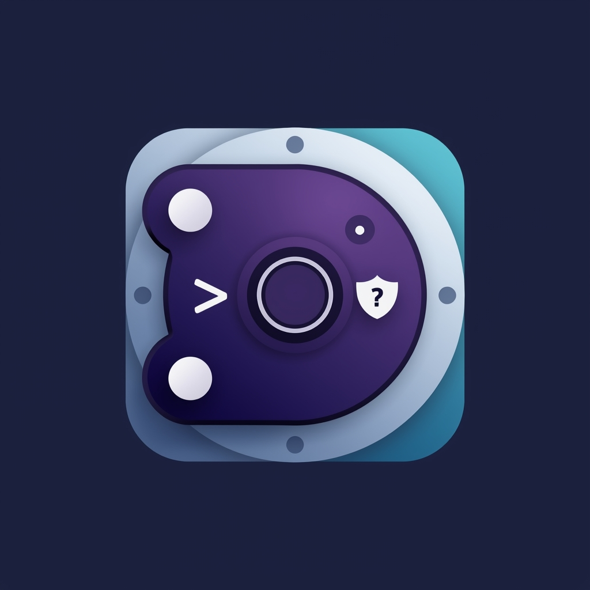

  

<h1 align="center">DevVault</h1>

  <strong>Your Personal Developer Resource Vault</strong>

  
  
  

  <a href="#-features">Features</a> •
  <a href="#-download">Download</a> •
  <a href="#-tech-stack">Tech Stack</a> •
  <a href="#-contributing">Contributing</a>

---

## 🚀 About

**DevVault** is a cross-platform application that helps developers store, organize, search, and reuse high-quality development resources. Stop losing valuable code snippets, commands, and solutions in scattered notes and bookmarks.

## ✨ Features

| Feature | Description |
|---------|-------------|
| 🔍 **Fuzzy Search** | Find resources instantly with intelligent fuzzy matching |
| 🏷️ **Smart Tags** | Organize with multiple tags per resource |
| 📂 **Categories** | Group by Snippet, Command, Solution, Reference, Boilerplate |
| 🌙 **Dark Mode** | Easy on the eyes with beautiful dark theme |
| 💾 **Offline First** | Works completely offline with local SQLite storage |
| 📤 **Export/Import** | Backup and share your resources as JSON |
| ⌨️ **Keyboard Shortcuts** | Power-user friendly with full keyboard navigation |

## 📥 Download

| Platform | Download |
|----------|----------|
| 🪟 **Windows** | [DevVault-v1.0.0-Setup.exe](https://github.com/RuchitDoshi30/DevVault/releases) |
| 🤖 **Android** | [DevVault-v1.0.0-android.apk](https://github.com/RuchitDoshi30/DevVault/releases) |

## 🛠️ Tech Stack

- **Framework:** Flutter 3.38+
- **Database:** SQLite (Drift)
- **State Management:** Riverpod

## 👨‍💻 Author

**Ruchit Doshi**

---

  Made with ❤️ by <a href="https://github.com/RuchitDoshi30">Ruchit Doshi</a>

  ⭐ Star this repo if you find it useful!

